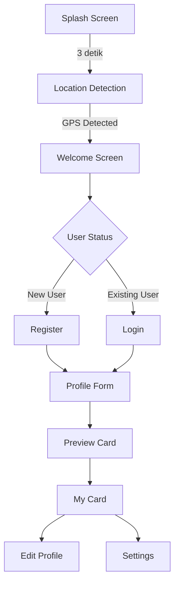

## PROJECT APLIKASI ANDROID STUDIO
## ID CARD DIGITAL

**Nama** : Wahyu Andika  
**NIM** : 312410182  
**Kelas** : TI.24.A2  
**Matkul** : Pemrograman Mobile 1  
**Dosen Pengampu** : Donny Maulana, S.Kom., M.M.S.I.


#  ID Card Digital - Jawa Barat


Aplikasi **ID Card Digital** adalah sistem kartu identitas digital berbasis lokasi untuk wilayah Jawa Barat (Bandung dan Bekasi) dengan fitur multi-bahasa (Indonesia dan Sunda).

##   Fitur Utama

###  Location-Based Features
- **Deteksi Lokasi Otomatis** menggunakan GPS (Bandung & Bekasi)
- **Dynamic Background** sesuai kota yang terdeteksi
  - Bandung: Background Gedung Sate
  - Bekasi: Background Pemda Bekasi
- **Multi-Language Support**
  - Bahasa Indonesia (Bekasi)
  - Bahasa Sunda (Bandung)

###  User Interface
- **Modern Splash Screen** dengan gradient biru dan animasi smooth
- **Logo Jawa Barat** konsisten di semua lokasi
- **Responsive Design** dengan Material Design components
- **Dark Overlay** untuk readability di atas foto background

###  User Management
- **Registration & Login System**
- **Profile Management** dengan foto profil
- **Auto-Crop Profile Picture** ke bentuk kotak (1:1 ratio)
- **Edit Profile** dengan validasi form

###  Digital ID Card
- **Kartu ID Digital** dengan data lengkap user
- **Dynamic Card Background** sesuai lokasi
- **QR Code Integration** (planned)
- **Export ke Image** (planned)

##  Arsitektur Aplikasi

### Tech Stack
- **Language:** Java
- **UI Framework:** Android SDK
- **Architecture:** MVC (Model-View-Controller)
- **Storage:** SharedPreferences + Internal Storage
- **GPS:** Android Location Services
- **UI Components:** Material Components, CardView, ConstraintLayout

### Project Structure

```
app/src/main/java/com/example/idcarddigital/
├── utils/
│   ├── AppPreferences.java          # SharedPreferences manager
│   ├── LocalisationHelper.java      # Multi-language handler
│   └── LocationUtils.java           # GPS utilities
├── BaseActivity.java                # Base class untuk semua activity
├── SplashActivity.java              # Splash screen dengan animasi
├── LocationDetectionActivity.java   # Deteksi GPS & set lokasi
├── WelcomeActivity.java             # Welcome screen dengan logo
├── LoginActivity.java               # Login system
├── RegisterActivity.java            # Registration system
├── ProfileFormActivity.java         # Form input profil user
├── MyCardActivity.java              # Display kartu ID digital
├── EditProfileActivity.java         # Edit profil & foto
└── SettingsActivity.java            # App settings
```

##  Getting Started

### Prerequisites
- Android Studio Arctic Fox atau lebih baru
- JDK 11 atau lebih baru
- Android SDK API 24 (Android 7.0) atau lebih tinggi
- Device/Emulator dengan GPS enabled

### Configuration

#### AndroidManifest.xml
```xml
<!-- Permissions Required -->
<uses-permission android:name="android.permission.ACCESS_FINE_LOCATION" />
<uses-permission android:name="android.permission.ACCESS_COARSE_LOCATION" />
<uses-permission android:name="android.permission.INTERNET" />
<uses-permission android:name="android.permission.READ_MEDIA_IMAGES" />
<uses-permission android:name="android.permission.READ_EXTERNAL_STORAGE" 
    android:maxSdkVersion="32" />
```

#### GPS Coordinates
Lokasi didefinisikan di `LocationDetectionActivity.java`:
```java
// Bandung: -6.9175, 107.6191 (Radius 30km)
// Bekasi: -6.2349, 106.9896 (Radius 30km)
```

##  User Flow



##  Data Storage

### SharedPreferences
Menyimpan data berikut:
- **User Credentials:** Email, Password (⚠️ Plain text - needs encryption)
- **User Profile:** Nama, NIM, Jurusan, Umur, Tanggal Lahir, Alamat
- **Location Data:** Kota, Bahasa, Background/Logo Resource ID
- **App State:** Login status, First time user

### Internal Storage
```
/data/data/com.example.idcarddigital/files/
└── profile_picture.jpg    # Foto profil user (JPEG, max 1024x1024)
```

##  Design System

### Color Palette
```xml
<!-- Primary Colors -->
<color name="blue_primary">#2196F3</color>
<color name="blue_dark">#1E88E5</color>

<!-- Accent Colors -->
<color name="red_accent">#E70011</color>
<color name="gold_accent">#FFC107</color>
<color name="green_accent">#4CAF50</color>

<!-- Text Colors -->
<color name="white">#FFFFFF</color>
<color name="black">#000000</color>
```

### Typography
- **Display:** 40sp, Bold (Greeting)
- **Heading:** 24sp, Bold (Titles)
- **Body:** 16-18sp, Regular (Content)
- **Caption:** 12-14sp, Regular (Subtitles)

### Components
- **CardView** dengan elevation 8dp-12dp
- **Rounded Corners** 12dp-20dp
- **Shadow** untuk depth perception
- **Gradient Backgrounds** untuk splash dan overlays

##  Security Considerations

### Current Implementation
⚠️ **Security Concerns:**
- Password disimpan dalam plain text di SharedPreferences
- Tidak ada enkripsi untuk data sensitif
- Tidak ada session management
- Single device usage only

### Recommended Improvements
 **Security Enhancements:**
1. Implement password hashing (SHA-256 minimum)
2. Encrypt SharedPreferences menggunakan EncryptedSharedPreferences
3. Add biometric authentication
4. Implement proper session management
5. Add SSL Pinning untuk API calls (future)

##  Known Issues

1. **Password Security** - Password tersimpan plain text
2. **No Data Backup** - Data hilang jika app di-uninstall
3. **Single User** - Hanya support 1 user per device
4. **No Sync** - Tidak ada sinkronisasi antar device
5. **GPS Dependency** - Butuh GPS aktif untuk deteksi lokasi

##  Future Enhancements

### Phase 1: Security & Database (Priority: High)
- [ ] Implement Firebase Authentication
- [ ] Migrate to Firestore Database
- [ ] Add Firebase Storage untuk foto profil
- [ ] Implement password hashing
- [ ] Add biometric authentication

### Phase 2: Features (Priority: Medium)
- [ ] QR Code generation untuk kartu ID
- [ ] Export kartu ke image (PNG/PDF)
- [ ] Share kartu via social media
- [ ] Dark mode support
- [ ] Notification system
- [ ] Multi-user support

### Phase 3: Expansion (Priority: Low)
- [ ] Tambah kota lain (Jakarta, Surabaya, dll)
- [ ] Support bahasa daerah lainnya
- [ ] Integration dengan sistem kampus
- [ ] Attendance tracking
- [ ] Admin dashboard

##  Performance Metrics

- **APK Size:** ~8 MB
- **Min RAM:** 2 GB
- **GPS Detection Time:** 2-5 detik (optimal condition)
- **Image Processing:** <1 detik (crop & save)
- **App Launch Time:** 3 detik (splash screen)

##  Contributing

Contributions are welcome! Untuk berkontribusi:

1. Fork repository ini
2. Create feature branch (`git checkout -b feature/AmazingFeature`)
3. Commit changes (`git commit -m 'Add some AmazingFeature'`)
4. Push to branch (`git push origin feature/AmazingFeature`)
5. Open Pull Request

### Coding Standards
- Gunakan **Java Code Conventions**
- Tambahkan **comments** untuk logic kompleks
- Pastikan **no compiler warnings**
- Test di **minimal 2 devices** (emulator + real device)

##  License

This project is licensed under the MIT License - see the [LICENSE](LICENSE) file for details.

##  Developer

**Wahyu Andika**
- Email: wahyuandika0147@gmail.com
- LinkedIn: [Wahyu Andika](https://www.linkedin.com/in/wahyu-andika-347306301)

---

###  Changelog

#### Version 1.0.0 (18 Desember 2025)
-  Initial release
- ✅ Splash screen dengan animasi biru modern
- ✅ Location-based UI (Bandung & Bekasi)
- ✅ Multi-language support (Indonesia & Sunda)
- ✅ Profile management dengan foto
- ✅ Digital ID Card display
- ✅ Auto-crop profile picture

---

Click Up(Timeline)
https://sharing.clickup.com/90181757899/g/h/2kzm0uyb-638/29fc368dcde01f7

FIGMA UX
https://www.figma.com/design/7Uo9ZhhQ51jbHYT4OKgsOp/Untitled?node-id=0-1&t=Zj0VZ235WDbl9mnx-1

## storyBoard


## Mockup/Wireframe


## UI/UX


