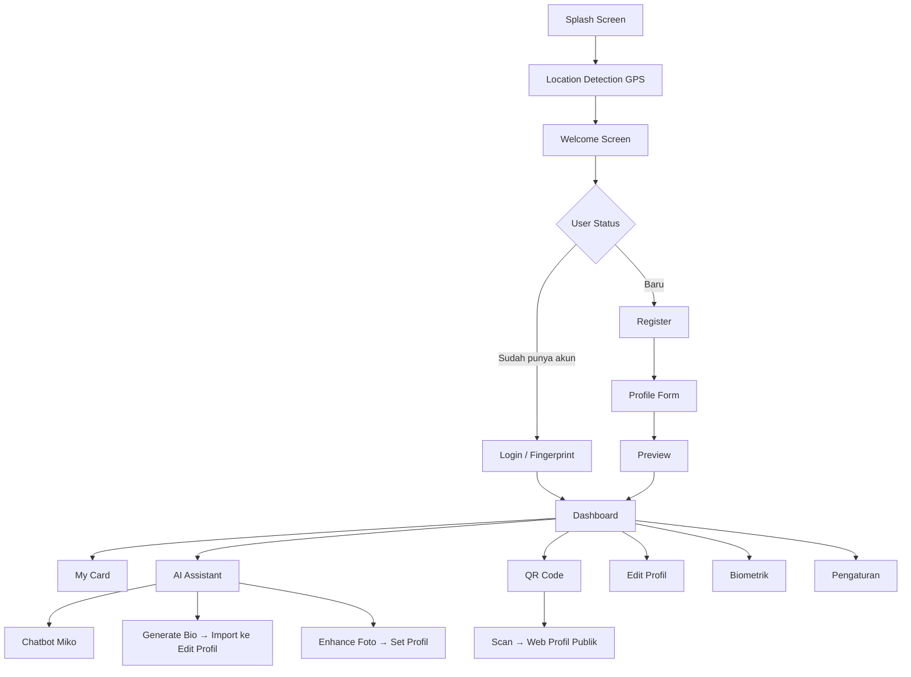

# ID Card Digital - Jawa Barat


**Nama** : Wahyu Andika
**NIM** : 312410182
**Kelas** : TI.24.A2
**Matkul** : Pemrograman Mobile 1
**Dosen Pengampu** : Donny Maulana, S.Kom., M.M.S.I.

---

Aplikasi **ID Card Digital** adalah sistem kartu identitas digital berbasis lokasi untuk wilayah Jawa Barat (Bandung dan Bekasi) dengan fitur AI Assistant, QR Code, dan sistem biometrik.

---

## Fitur Utama

### Location-Based Features
- **Deteksi Lokasi Otomatis** menggunakan GPS (Bandung & Bekasi)
- **Dynamic Background** sesuai kota yang terdeteksi
  - Bandung → Background Gedung Sate
  - Bekasi → Background Pemda Bekasi
- **Multi-Language Support**
  - Bahasa Indonesia (Bekasi)
  - Bahasa Sunda (Bandung)
- **ScaleType adaptif** per kota untuk presisi tampilan background

### User Interface (Design System Baru)
- **Design System Konsisten** — primary `#2563EB`, background `#F8FAFC`, dark text `#0F172A`
- **Modern Card UI** dengan border `#E2E8F0`, radius 16dp, elevation subtle
- **Input Field** custom `bg_input_field` — gray bg + border + radius 10dp
- **Button Hierarchy** — primary, secondary, danger, fingerprint, white outline
- **Glass Effect Badge** di Welcome Screen
- **Gradient Overlay** (bukan flat overlay) di semua screen berbackground foto
- **Vector Icons** untuk semua menu dashboard — tanpa emoji

### User Management
- **Registration & Login** via Firebase Firestore
- **Fingerprint / Biometric Login** menggunakan BiometricPrompt
- **Profile Management** dengan foto profil
- **Foto Profil via Base64** — disimpan langsung ke Firestore field `photoUrl` (tanpa Firebase Storage)
- **Auto-Crop & Compress** profile picture ke 512x512 sebelum upload
- **Edit Profile** dengan DatePickerDialog, form validasi, dan import Bio dari AI
- **Forgot Password** flow

### Digital ID Card
- **Kartu ID Digital** dengan header biru, foto profil bulat, badge Terverifikasi
- **Dynamic Card Background Strip** sesuai lokasi
- **Logo Jawa Barat** konsisten di semua lokasi
- **QR Code** generate otomatis → scan buka web profil publik
- **Web Profile** — `https://id-card-digital.web.app/?uid={email_sanitized}`

### AI Assistant (Gemini 2.5 Flash)
- **Chatbot Miko** — tanya jawab seputar profil dan kampus, strip markdown otomatis
- **Generate Bio** — AI buat bio profesional (max 20 kata), langsung import ke field Bio di Edit Profil via Intent
- **Enhance Foto** — brightness, contrast, HD Sharpening (convolution kernel), simpan ke galeri, set sebagai foto profil + sync cloud

### Keamanan
- **Biometric Authentication** — fingerprint untuk login cepat
- **Biometric Settings** — aktifkan/nonaktifkan fingerprint
- **Firebase Firestore Rules** — `allow read, write: if true` (development)
- **Merge Strategy** — `SetOptions.merge()` untuk update field tanpa overwrite field lain

---

## Arsitektur Aplikasi

### Tech Stack
| Komponen | Teknologi |
|---|---|
| Language | Java |
| UI Framework | Android SDK + Material Components |
| Architecture | MVC |
| Database | Firebase Firestore (asia-southeast2) |
| Storage Foto | Base64 string di Firestore |
| GPS | Android Location Services |
| AI | Gemini 2.5 Flash API |
| QR Code | ZXing (zxing-android-embedded) |
| Biometrik | AndroidX BiometricPrompt |
| Build | Gradle (Kotlin DSL) |

### Project Structure

```
app/src/main/java/com/example/idcarddigital/
├── models/
│   └── User.java
├── utils/
│   ├── AppPreferences.java          # SharedPreferences manager
│   ├── FirebaseManager.java         # Firestore CRUD operations
│   ├── LocalisationHelper.java      # Multi-language handler
│   └── LocationUtils.java           # GPS utilities
├── BaseActivity.java                # Base class (locale, background, scaleType per kota)
├── SplashActivity.java
├── LocationDetectionActivity.java
├── WelcomeActivity.java
├── LoginActivity.java               # Email + fingerprint login
├── RegisterActivity.java
├── ForgotPasswordActivity.java
├── ProfileFormActivity.java
├── PreviewActivity.java
├── DashboardActivity.java           # 6 menu grid dengan vector icons
├── MyCardActivity.java              # ID Card + detail info
├── EditProfileActivity.java         # Foto kamera/galeri → Base64 → Firestore
├── AiAssistantActivity.java         # ViewPager2: Chatbot, Generate Bio, Enhance Foto
├── QrCodeActivity.java              # Generate QR → web profil
├── BiometricSettingsActivity.java
├── SettingsActivity.java
└── AboutActivity.java
```

---

## Getting Started

### Prerequisites
- Android Studio (Arctic Fox atau lebih baru)
- JDK 17
- Android SDK API 24+
- Device/Emulator dengan GPS
- Firebase project: `id-card-digital` (asia-southeast2)
- Gemini API Key dari Google AI Studio

### Konfigurasi

#### 1. Firebase
Tambahkan `google-services.json` ke folder `app/`

Firestore Rules (development):
```
rules_version = '2';
service cloud.firestore {
  match /databases/{database}/documents {
    match /{document=**} {
      allow read, write: if true;
    }
  }
}
```

#### 2. Gemini API Key
Di `AiAssistantActivity.java`:
```java
public static final String GEMINI_API_KEY = "YOUR_API_KEY_HERE";
```

#### 3. GPS Coordinates
Di `LocationDetectionActivity.java`:
```java
// Bandung: -6.9175, 107.6191 (Radius 30km)
// Bekasi: -6.2349, 106.9896 (Radius 30km)
```

#### 4. UID Format
```java
String uid = email.replace(".", "_").replace("@", "_at_");
// contoh: wahyu.andika@gmail.com → wahyu_andika_at_gmail_com
```

---

## User Flow


```mermaid
graph TD
    A[Splash Screen] --> B[Location Detection GPS]
    B --> C[Welcome Screen]
    C --> D{User Status}
    D -->|Baru| E[Register]
    D -->|Sudah punya akun| F[Login / Fingerprint]
    E --> G[Profile Form]
    F --> H[Dashboard]
    G --> I[Preview]
    I --> H
    H --> J[My Card]
    H --> K[AI Assistant]
    H --> L[QR Code]
    H --> M[Edit Profil]
    H --> N[Biometrik]
    H --> O[Pengaturan]
    K --> K1[Chatbot Miko]
    K --> K2[Generate Bio → Import ke Edit Profil]
    K --> K3[Enhance Foto → Set Profil]
    L --> L1[Scan → Web Profil Publik]
```

---

## Data Storage

### Firebase Firestore
Collection: `users` — Document ID: `{uid}`

| Field | Type | Keterangan |
|---|---|---|
| `email` | String | Email pengguna |
| `password` | String | Password (plain text) |
| `name` | String | Nama lengkap |
| `nim` | String | NIM mahasiswa |
| `major` | String | Jurusan |
| `age` | String | Umur |
| `dob` | String | Tanggal lahir |
| `address` | String | Alamat domisili |
| `instagram` | String | Bio profesional (alias) |
| `photoUrl` | String | Base64 foto profil |
| `updatedAt` | Long | Timestamp update terakhir |

### SharedPreferences
Cache lokal dari data Firestore untuk akses cepat tanpa koneksi.

---

## Design System

### Color Palette
```xml
#2563EB   <!-- Primary Blue -->
#0F172A   <!-- Dark Text -->
#64748B   <!-- Gray -->
#94A3B8   <!-- Light Gray -->
#E2E8F0   <!-- Border -->
#F8FAFC   <!-- Background -->
#16A34A   <!-- Success Green -->
#DC2626   <!-- Danger Red -->
```

### Drawable Components
| Drawable | Fungsi |
|---|---|
| `bg_button_primary` | Tombol utama biru solid |
| `bg_button_secondary` | Tombol outline biru |
| `bg_button_danger` | Tombol hapus merah |
| `bg_button_fingerprint` | Tombol fingerprint biru muda |
| `bg_input_field` | Input field gray + border |
| `bg_card_form` | Card putih + border + radius |
| `bg_card_header` | Header card biru radius atas |
| `bg_badge_verified` | Badge terverifikasi biru pill |
| `bg_profile_photo` | Background avatar oval + border |
| `bg_camera_badge` | Badge kamera biru bulat |
| `gradient_overlay_top` | Overlay gelap dari atas |
| `gradient_overlay_bottom` | Overlay gelap dari bawah |
| `bg_badge_glass` | Glass effect pill transparan |
| `bg_location_chip` | Chip lokasi frosted glass |
| `bg_menu_icon_*` | Background icon menu (6 warna) |

---

## Web Profile

URL format:
```
https://id-card-digital.web.app/?uid={email_sanitized}
```

Foto profil ditampilkan dari Base64 yang tersimpan di Firestore field `photoUrl`.

---

## Performance

- **APK Size:** ~10 MB
- **Min RAM:** 2 GB
- **Gradle Heap:** 4096 MB (dioptimasi)
- **Build Cache:** aktif (`org.gradle.caching=true`)
- **Parallel Build:** aktif (`org.gradle.parallel=true`)

---

## Known Issues

1. Password tersimpan plain text di Firestore dan SharedPreferences
2. Foto Base64 besar bisa memperlambat load jika koneksi lambat
3. GPS butuh kondisi outdoor untuk akurasi optimal
4. Gemini API membutuhkan koneksi internet aktif

---

## Future Enhancements

- [ ] Enkripsi password dengan bcrypt
- [ ] EncryptedSharedPreferences
- [ ] Firebase Authentication proper
- [ ] Export kartu ke PNG/PDF
- [ ] Dark mode
- [ ] Tambah kota (Jakarta, Surabaya, dll)
- [ ] Admin dashboard

---

## Storyboard


## Mockup / Wireframe


## UI/UX


---

## Links

- **Figma:** https://www.figma.com/design/7rAZhrMLyJTur0HJrF8aN4/Untitled?node-id=0-1&t=dnL0t6RCMm58EmWn-1
- **ClickUp Timeline:** https://sharing.clickup.com/90181757899/b/h/6-901817844631-2/6a5a70259283a2f
- **Web Profile:** https://id-card-digital.web.app

---

## Changelog

### Version 2.0.0 (Juni 2026)
- Rebuild total UI dengan design system baru (#2563EB primary)
- Migrasi storage foto dari Internal Storage ke Base64 Firestore
- Tambah AI Assistant (Chatbot Miko, Generate Bio, Enhance Foto) via Gemini 2.5 Flash
- Tambah QR Code → web profil publik
- Tambah Biometric Settings
- Tambah ForgotPassword, Dashboard, About Activity
- Fix ScaleType background per kota (Bekasi fitXY, Bandung centerCrop)
- Fix ic_camera.xml path data corrupt → crash EditProfile
- Optimasi Gradle build (parallel, cache, heap 4096MB)
- Ganti emoji menu dengan vector drawable icons

### Version 1.0.0 (18 Desember 2025)
- Initial release
- Splash screen, Location detection, Welcome screen
- Register, Login, Profile Form, My Card
- Location-based background dan multi-language

---

## Developer

**Wahyu Andika**
- Email: wahyuandika0147@gmail.com
- LinkedIn: [Wahyu Andika](https://www.linkedin.com/in/wahyu-andika-347306301)

---

### Commit Message yang Disarankan

```
feat: rebuild UI design system v2 + AI features + Firebase migration

- Rebuild semua activity dengan design system baru (#2563EB)
- Migrasi foto profil dari internal storage ke Base64 Firestore
- Add AI Assistant: Chatbot Miko, Generate Bio, Enhance Foto (Gemini 2.5 Flash)
- Add QR Code generate → web profil publik
- Add Dashboard dengan vector icons (no emoji)
- Add BiometricSettings, ForgotPassword, About activity
- Fix background scaleType per kota (Bekasi/Bandung)
- Fix ic_camera.xml corrupt path → crash EditProfileActivity
- Fix Gemini API endpoint ke gemini-2.5-flash v1
- Fix foto profil load dari Base64 di semua activity
- Optimasi Gradle: parallel build, cache, heap 4096MB
- Add gradient overlay (bukan flat overlay) di semua bg screen
```
